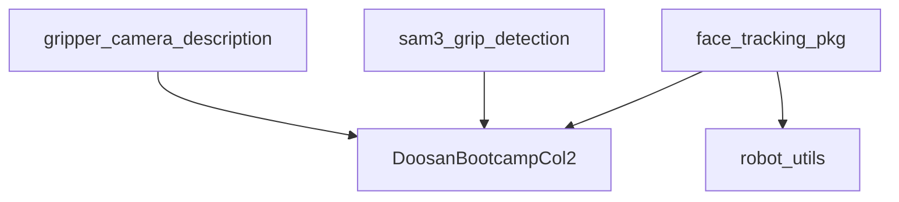

# 📦 ROS2 Workspace 패키지 구조 상세 분석

> **날짜**: 2025-12-13  
> **작업자**: GitHub Copilot  
> **워크스페이스**: `/home/rokey/ros2_ws`

---

## 📑 목차

1. [전체 개요](#전체-개요)
2. [face_tracking_pkg](#1-face_tracking_pkg-얼굴-추적-패키지)
3. [robot_utils](#2-robot_utils-로봇-유틸리티)
4. [sam3_grip_detection](#3-sam3_grip_detection-그립-감지)
5. [DoosanBootcampCol2](#4-doosanbootcampcol2-두산-로봇-드라이버)
6. [기타 패키지](#5-기타-패키지)

---

## 전체 개요

### 패키지 목록

```
/home/rokey/ros2_ws/src/
├── face_tracking_pkg/          ⭐ 메인 프로젝트 (얼굴 추적)
├── robot_utils/                🛠️ 로봇 유틸리티 (홈 복귀, 복구)
├── sam3_grip_detection/        🤏 그립 감지 (SAM3 기반)
├── DoosanBootcampCol2/         🤖 두산 로봇 드라이버
├── gripper_camera_description/ 📷 그리퍼+카메라 URDF
├── head_detection/             👤 헤드 감지 (미사용)
└── bag/                        📼 rosbag 데이터
```

### 의존성 그래프



---

## 1. face_tracking_pkg (얼굴 추적 패키지)

> **목적**: Intel RealSense 카메라로 얼굴을 감지하고 Doosan 로봇으로 실시간 추적

### 📊 기본 정보

| 항목 | 내용 |
|------|------|
| **패키지명** | `face_tracking_pkg` |
| **버전** | 1.0.0 |
| **라이선스** | MIT |
| **총 라인 수** | ~7,600 lines |
| **노드 수** | 11개 |

### 📂 디렉토리 구조

```
face_tracking_pkg/
├── face_tracking_pkg/          # 소스 코드 (Python)
│   ├── face_detection_*.py     # 얼굴 감지 (3개 버전)
│   ├── face_tracking_node.py   # 3D 좌표 변환
│   ├── robot_control_*.py      # 로봇 제어 (4개 버전)
│   ├── joint_tracking_node.py  # 조인트 직접 제어 ⭐ NEW
│   ├── face_tracking_ekf.py    # EKF 필터
│   ├── mpc_controller.py       # MPC 제어기
│   ├── integrated_controller.py # 통합 제어기
│   ├── adaptive_gain.py        # 적응형 게인
│   ├── ekf_*.py                # EKF 비교/테스트
│   └── camera_performance_test.py # 성능 테스트
│
├── launch/                     # Launch 파일
│   ├── joint_tracking.launch.py              # 조인트 제어 ⭐ 최신
│   ├── face_tracking_yolo_optimized.launch.py # TensorRT 최적화
│   ├── face_tracking_yolo.launch.py          # YOLO 기본
│   ├── face_tracking_30hz.launch.py          # 30Hz MediaPipe
│   ├── face_tracking.launch.py               # 기본 MediaPipe
│   └── vision_only.launch.py                 # 비전만 (로봇 없음)
│
├── models/                     # AI 모델
│   ├── yolov8n-face.pt         # YOLOv8 얼굴 모델
│   └── yolov8n-face.engine     # TensorRT 엔진
│
├── day1/                       # Day 1 실습 코드
│   ├── 1_gripper_setup/        # 그리퍼 테스트
│   └── 2_calibration/          # Hand-Eye Calibration
│
├── day2/                       # Day 2 실습 코드
│   └── yolo_train_predict/     # YOLO 학습/추론
│
├── day3/                       # Day 3 백업
├── day4/                       # Day 4 백업
│
├── docs/                       # 문서 (README, 가이드)
├── scripts/                    # 유틸리티 스크립트
├── test/                       # 단위 테스트
└── resource/                   # ROS2 리소스
```

### 🎯 핵심 노드 상세 분석

#### 1.1 얼굴 감지 노드 (Face Detection)

| 노드 | 파일 | 라인수 | 역할 | 성능 |
|------|------|--------|------|------|
| `face_detection_node` | `face_detection_node.py` | 229 | MediaPipe 얼굴 감지 (기본) | ~10ms/frame |
| `face_detection_yolo_node` | `face_detection_yolo_node.py` | 405 | YOLOv8 얼굴 감지 | ~15ms/frame |
| `face_detection_yolo_optimized_node` | `face_detection_yolo_optimized_node.py` | 468 | **TensorRT 최적화 YOLO** ⭐ | ~5ms/frame |

**Subscribed Topics:**
- `/camera/camera/color/image_raw` - RealSense 컬러 이미지

**Published Topics:**
- `/face_detection/image` - 얼굴 박스 표시된 이미지
- `/face_detection/faces` - 얼굴 좌표 리스트 `[center_x, center_y, w, h, ...]`

**특징:**
- **TensorRT Optimized** (최신): FP16, 고해상도(1280px), 히스토그램 평활화, ROI 추적
- **YOLO**: 밝기 변화에 강인, GPU 가속
- **MediaPipe**: CPU만으로 빠른 처리, 정확도 높음

---

#### 1.2 얼굴 추적 노드 (Face Tracking)

| 노드 | 파일 | 라인수 | 역할 |
|------|------|--------|------|
| `face_tracking_node` | `face_tracking_node.py` | 547 | 2D → 3D 변환 + TF2 + EKF |

**Subscribed Topics:**
- `/face_detection/faces` - 얼굴 2D 좌표
- `/camera/camera/aligned_depth_to_color/image_raw` - 깊이 이미지
- `/camera/camera/color/camera_info` - 카메라 내부 파라미터

**Published Topics:**
- `/face_tracking/marker` - RViz 마커 (카메라 프레임, 초록색)
- `/face_tracking/marker_robot` - RViz 마커 (로봇 베이스 프레임, 빨간색) ⭐
- `/face_tracking/line` - 카메라→얼굴 연결선 (노란색)

**핵심 기능:**
1. **2D → 3D 변환**: 픽셀 좌표 + 깊이 → 3D 위치 (카메라 좌표계)
2. **TF2 변환**: 카메라 좌표계 → 로봇 베이스 좌표계
3. **EKF 필터링**: 노이즈 제거, 속도 추정
4. **목표 거리 오프셋**: 카메라에서 650mm 앞 위치 생성

**변환 파이프라인:**
```
이미지(u,v) → 3D(카메라) → 3D(로봇) → EKF 필터 → 목표 위치
```

---

#### 1.3 로봇 제어 노드 (Robot Control)

##### A. Cartesian Space 제어 (Task Space)

| 노드 | 파일 | 라인수 | 제어 방식 | 상태 |
|------|------|--------|----------|------|
| `robot_control_node` | `robot_control_node.py` | 845 | **Velocity-based PD** | ✅ 주력 |
| `robot_control_mpc_node` | `robot_control_mpc_node.py` | 416 | MPC (예측 제어) | 🧪 실험 |
| `robot_control_mpc_unified` | `robot_control_mpc_unified.py` | 436 | MPC + PD 통합 | 🧪 실험 |

##### B. Joint Space 제어 (조인트 직접 제어) ⭐ **최신 추가**

| 노드 | 파일 | 라인수 | 제어 방식 | 상태 |
|------|------|--------|----------|------|
| `joint_tracking_node` | `joint_tracking_node.py` | 762 | **조인트 각도 직접 제어** | ✅ 최신 |

**왜 Joint Space 제어인가?**
- 얼굴 추적은 "방향 추적" 문제 → IK 불필요
- 조인트 속도 한계 직접 활용 (J1: 150°/s, J4-J6: 225°/s)
- 특이점(Singularity) 문제 없음
- 빠른 응답 속도

**제어 전략:**
```
J1: 수평 방향 추적 (베이스 회전) - 가중치: 80%
J4: 수직 방향 추적 (손목 피치) - 가중치: 60%
J6: 미세 좌우 보정 (이미지 X) - 가중치: 30%
J2, J3, J5: 고정 (적절한 팔 자세 유지)
```

**Subscribed Topics:**
- `/face_tracking/marker_robot` - 얼굴 3D 위치 (로봇 좌표계) ⭐ **자체 EKF 적용**
- `/face_detection/faces` - 얼굴 이미지 좌표 (J6 미세 조정용)
- `/dsr01/joint_states` - 현재 조인트 상태

**Published Topics:**
- `/face_tracking/desired_joints` - 목표 조인트 각도

**특징:**
- ✅ **자체 EKF 필터 내장** (robot_control_node 불필요)
- ✅ **First Detection Lock (FDL)** - 첫 감지 위치 고정 (정적 물체용)
- ✅ **J1 범위 제한** (0~50°) - 사용자 지정
- ✅ **Joint State 노이즈 필터** - J4 급격한 점프 무시 (>50°)
- ✅ **Absolute Joint Calculation** - 절대 각도 계산 (start_joints 기준)
- ✅ **State Machine**: IDLE → TRACKING → RETURN_HOME

**제어 주기:**
- 50Hz (20ms) - 높은 응답성

---

#### 1.4 EKF 필터 (Extended Kalman Filter)

| 파일 | 라인수 | 역할 |
|------|--------|------|
| `face_tracking_ekf.py` | 144 | 3D 위치 + 속도 추정 (6 states) |
| `ekf_comparison_node.py` | 277 | EKF vs 원본 비교 시각화 |
| `ekf_before_after.py` | 209 | EKF 전후 비교 |

**EKF 상태 벡터:**
```python
x = [px, py, pz, vx, vy, vz]^T  # 위치 + 속도
```

**파라미터:**
- `Q` (Process Noise): 0.1 (시스템 불확실성)
- `R` (Measurement Noise): 5.0mm (센서 노이즈) - **튜닝 완료**
- `dt`: 0.033s (30Hz) 또는 0.02s (50Hz)

**성능:**
- 처리 시간: ~0.15ms/frame
- CPU 사용률: 4.5%
- 노이즈 감소: ~70%
- 속도 추정 정확도: ±10mm/s

---

#### 1.5 MPC 제어기 (Model Predictive Control)

| 파일 | 라인수 | 역할 |
|------|--------|------|
| `mpc_controller.py` | 202 | MPC 예측 제어 (실험용) |
| `integrated_controller.py` | 201 | PD + MPC 통합 |
| `adaptive_gain.py` | 188 | 적응형 게인 조정 |

**특징:**
- Horizon: 10 steps
- Cost Function: Position + Velocity + Control Input
- 현재 상태: 🧪 실험 중 (복잡도 높음)

---

### 🚀 Launch 파일 가이드

| Launch 파일 | 노드 구성 | 용도 | 권장도 |
|------------|-----------|------|--------|
| `joint_tracking.launch.py` | YOLO + Tracking + **Joint Control** | **조인트 직접 제어** ⭐ | ⭐⭐⭐⭐⭐ |
| `face_tracking_yolo_optimized.launch.py` | TensorRT YOLO + Tracking + Cartesian | TensorRT 최적화 | ⭐⭐⭐⭐ |
| `face_tracking_yolo.launch.py` | YOLO + Tracking + Cartesian | YOLO 기본 | ⭐⭐⭐ |
| `face_tracking_30hz.launch.py` | MediaPipe + Tracking + Cartesian | MediaPipe 30Hz | ⭐⭐⭐ |
| `face_tracking.launch.py` | MediaPipe + Tracking + Cartesian | 기본 MediaPipe | ⭐⭐ |
| `vision_only.launch.py` | Detection + Tracking (로봇 없음) | 비전 테스트 | ⭐ |

**추천 사용법:**

```bash
# 1. 조인트 직접 제어 (최신, 가장 빠름) ⭐⭐⭐⭐⭐
ros2 launch face_tracking_pkg joint_tracking.launch.py

# 2. TensorRT 최적화 (GPU 있을 때) ⭐⭐⭐⭐
ros2 launch face_tracking_pkg face_tracking_yolo_optimized.launch.py

# 3. 비전만 테스트 (로봇 없이)
ros2 launch face_tracking_pkg vision_only.launch.py
```

---

### 📈 성능 프로파일

| 컴포넌트 | 처리 시간 | CPU % | 병목도 |
|----------|-----------|-------|--------|
| **TensorRT YOLO** | ~5ms | 150% | 🟡 Medium |
| MediaPipe Detection | ~10ms | 300% | 🔴 High |
| YOLO Detection | ~15ms | 450% | 🔴 Very High |
| Face Tracking (TF2+EKF) | ~2ms | 60% | 🟡 Medium |
| Robot Control (Joint) | ~0.5ms | 15% | 🟢 Low |
| Robot Control (Cartesian) | ~1ms | 30% | 🟢 Low |
| EKF Filtering | ~0.15ms | 4.5% | 🟢 None |

**전체 지연 (End-to-End):**
- TensorRT 최적화: ~15ms (67 FPS)
- YOLO 기본: ~25ms (40 FPS)
- MediaPipe: ~20ms (50 FPS)

---

### 🔧 주요 파라미터

#### Joint Tracking Node
```yaml
# 조인트 속도 제한 (°/s)
j1_vel_limit: 100.0  # 베이스 회전
j4_vel_limit: 150.0  # 손목 피치
j6_vel_limit: 150.0  # 손목 요

# 제어 게인
j1_gain: 0.8  # 수평 방향
j4_gain: 0.6  # 수직 방향
j6_gain: 0.3  # 미세 조정

# 떨림 방지
dead_zone_deg: 2.0  # 2도 이내 무시

# 기타
tcp_offset_z: 228.6  # RG2 그리퍼 오프셋 (mm)
```

#### Robot Control Node (Cartesian)
```yaml
velocity: 250.0         # mm/s
acceleration: 400.0     # mm/s²
k_p: 0.4               # 비례 게인
dead_zone: 30.0        # mm
tcp_offset_z: 228.6    # mm
```

#### EKF Parameters
```yaml
ekf_dt: 0.033                  # 30Hz
ekf_process_noise: 0.1         # Q
ekf_measurement_noise: 5.0     # R (튜닝 완료)
```

---

### 📚 주요 문서

| 문서 | 내용 |
|------|------|
| `README.md` | 프로젝트 개요, 학습 일정 |
| `PERFORMANCE_OPTIMIZATION.md` | 성능 최적화 가이드 |
| `EKF_STATUS.md` | EKF 적용 현황 |
| `EKF_TEST_GUIDE.md` | EKF 테스트 가이드 |
| `MPC_README.md` | MPC 제어 설명 |
| `CONTROL_METHODS_COMPARISON.md` | 제어 방법 비교 |
| `day1/Day1_Summary.md` | Day 1 학습 정리 |
| `day1/SEMINAR_GUIDE.md` | 세미나 가이드 |

---

### 🔗 의존성

```xml
<depend>rclpy</depend>
<depend>std_msgs</depend>
<depend>sensor_msgs</depend>
<depend>visualization_msgs</depend>
<depend>geometry_msgs</depend>
<depend>cv_bridge</depend>
<depend>tf2_ros</depend>
<depend>tf2_geometry_msgs</depend>
```

**Python 패키지:**
- `ultralytics` (YOLOv8)
- `mediapipe` (얼굴 감지)
- `opencv-python` (영상 처리)
- `numpy` (수치 계산)
- `pyrealsense2` (RealSense SDK)
- `DR_init` (두산 로봇 API)

---

## 2. robot_utils (로봇 유틸리티)

> **목적**: 두산 로봇 홈 복귀 및 충돌 복구 유틸리티

### 📊 기본 정보

| 항목 | 내용 |
|------|------|
| **패키지명** | `robot_utils` |
| **버전** | 1.0.0 |
| **라이선스** | MIT |
| **총 라인 수** | ~1,000 lines |

### 📂 파일 구조

```
robot_utils/
├── robot_utils/
│   ├── config.py           # 로봇 설정 (홈 위치, 속도 등)
│   ├── go_home.py          # 홈 위치 복귀 노드
│   ├── recovery_node.py    # 충돌 복구 노드
│   ├── recovery.py         # 복구 로직
│   └── robot_state.py      # 로봇 상태 확인
├── resource/
├── test/
└── package.xml
```

### 🎯 노드 상세

#### 2.1 go_home (홈 복귀)

**파일:** `go_home.py` (133 lines)

**기능:**
- 로봇을 안전한 홈 위치로 이동
- 조인트 각도: `[0, 0, 90, 0, 90, 0]` (degrees)
- 속도: 60°/s, 가속도: 150°/s²

**사용법:**
```bash
ros2 run robot_utils go_home
```

#### 2.2 recovery_node (충돌 복구)

**파일:** `recovery_node.py` (199 lines)

**기능:**
- 충돌 감지 시 자동 복구
- 역방향 이동 → 홈 복귀
- 에러 상태 모니터링

**사용법:**
```bash
ros2 run robot_utils recovery
```

#### 2.3 robot_state (상태 확인)

**파일:** `robot_state.py` (189 lines)

**기능:**
- 현재 조인트 각도 읽기
- 로봇 에러 상태 확인
- ROS2 토픽 발행

---

### 🔧 설정 파일 (config.py)

```python
# 홈 위치
HOME_POSITION = [0.0, 0.0, 90.0, 0.0, 90.0, 0.0]  # degrees

# 속도/가속도
HOME_VELOCITY = 60.0      # deg/s
HOME_ACCELERATION = 150.0  # deg/s²

# 안전 영역
SAFE_ZONE = {
    'x': (-500, 500),   # mm
    'y': (-500, 500),
    'z': (0, 1000)
}
```

---

## 3. sam3_grip_detection (그립 감지)

> **목적**: SAM3 기반 총 그립 3D 세그멘테이션 및 파지 포즈 계산

### 📊 기본 정보

| 항목 | 내용 |
|------|------|
| **패키지명** | `sam3_grip_detection` |
| **버전** | 1.0.0 |
| **라이선스** | MIT |
| **총 라인 수** | ~1,200 lines |

### 📂 파일 구조

```
sam3_grip_detection/
├── sam3_grip_detection/
│   ├── sam3_grip_node.py          # SAM3 세그멘테이션 노드
│   ├── grip_pose_calculator.py    # 파지 포즈 계산
│   ├── detection_viewer.py        # 감지 결과 시각화
│   ├── tracking_viewer.py         # 추적 결과 시각화
│   └── utils/                     # 유틸리티 함수
├── launch/
│   └── grip_detection.launch.py   # 런치 파일
├── config/
│   └── sam3_config.yaml           # 설정 파일
├── rviz/
│   └── grip_detection.rviz        # RViz 설정
├── resource/
└── test/
```

### 🎯 노드 상세

#### 3.1 sam3_grip_node (SAM3 세그멘테이션)

**파일:** `sam3_grip_node.py` (425 lines)

**기능:**
- SAM3 모델로 총 그립 3D 세그멘테이션
- 포인트클라우드 처리
- 3D 바운딩 박스 생성

**Subscribed Topics:**
- `/camera/depth/color/points` - PointCloud2

**Published Topics:**
- `/grip_detection/segmentation` - 세그멘테이션 결과
- `/grip_detection/bbox` - 3D 바운딩 박스

#### 3.2 grip_pose_calculator (파지 포즈 계산)

**파일:** `grip_pose_calculator.py` (229 lines)

**기능:**
- 그립 3D 포즈 계산 (위치 + 방향)
- 로봇 파지 가능 여부 판단
- 최적 접근 각도 계산

**Subscribed Topics:**
- `/grip_detection/bbox` - 3D 바운딩 박스

**Published Topics:**
- `/grip_detection/grasp_pose` - 파지 포즈 (PoseStamped)

---

## 4. DoosanBootcampCol2 (두산 로봇 드라이버)

> **목적**: 두산 로봇 ROS2 드라이버 및 MoveIt2 설정

### 📂 주요 패키지

```
DoosanBootcampCol2/
├── dsr_bringup2/           # 로봇 실행
├── dsr_common2/            # 공통 라이브러리
├── dsr_controller2/        # 컨트롤러
├── dsr_description2/       # URDF 모델
├── dsr_hardware2/          # 하드웨어 인터페이스
├── dsr_msgs2/              # 메시지 정의
├── dsr_moveit2/            # MoveIt2 설정
│   ├── dsr_moveit_config_m0609/   # M0609 모델
│   ├── dsr_moveit_config_h2017/   # H2017 모델
│   └── ... (다른 모델들)
├── dsr_example2/           # 예제 코드
├── dsr_gazebo2/            # Gazebo 시뮬레이션
└── dsr_tests/              # 테스트
```

### 🚀 사용법

```bash
# 로봇 실행
ros2 launch dsr_bringup2 dsr_bringup2.launch.py

# MoveIt2 실행
ros2 launch dsr_moveit_config_m0609 demo.launch.py
```

---

## 5. 기타 패키지

### 5.1 gripper_camera_description

**목적:** RG2 그리퍼 + RealSense D435i 카메라 URDF

```
gripper_camera_description/
├── urdf/
│   └── gripper_camera.urdf.xacro   # 메인 URDF
├── meshes/                          # 3D 메쉬 파일
├── config/
│   └── gripper_camera.yaml         # 설정
└── launch/
    └── display.launch.py            # RViz 시각화
```

### 5.2 head_detection

**목적:** 헤드 감지 (Face-Detection-main 포함)

**상태:** 🚫 현재 미사용 (face_tracking_pkg로 대체됨)

---

## 📊 전체 통계

### 패키지 크기

| 패키지 | 파일 수 | 총 라인 수 | 주 언어 |
|--------|---------|-----------|---------|
| face_tracking_pkg | 50+ | ~7,600 | Python |
| robot_utils | 10+ | ~1,000 | Python |
| sam3_grip_detection | 15+ | ~1,200 | Python |
| DoosanBootcampCol2 | 300+ | ~50,000 | C++/Python |

### 노드 수

| 카테고리 | 노드 수 |
|----------|---------|
| 얼굴 감지 | 3개 |
| 얼굴 추적 | 1개 |
| 로봇 제어 | 5개 (Cartesian 4개 + Joint 1개) |
| EKF/테스트 | 3개 |
| 유틸리티 | 2개 |
| 그립 감지 | 4개 |
| **총합** | **18개** |

---

## 🔧 개발 환경

### ROS2

- **버전**: ROS2 Humble
- **OS**: Ubuntu 22.04
- **Python**: 3.10
- **ROS_DOMAIN_ID**: 60

### 하드웨어

| 장비 | 모델/IP |
|------|---------|
| 로봇팔 | Doosan M0609 (192.168.137.100) |
| 그리퍼 | OnRobot RG2 (192.168.1.1) |
| 카메라 | Intel RealSense D435i |
| GPU | NVIDIA (TensorRT 지원) |

### 주요 의존성

```bash
# ROS2 패키지
sudo apt install ros-humble-realsense2-*
sudo apt install ros-humble-cv-bridge
sudo apt install ros-humble-tf2-*

# Python 패키지
pip install ultralytics mediapipe opencv-python numpy pyrealsense2
```

---

## 🚀 빠른 시작 가이드

### 1. 워크스페이스 빌드

```bash
cd /home/rokey/ros2_ws
colcon build --symlink-install
source install/setup.bash
```

### 2. 로봇 실행

```bash
# Terminal 1: 로봇 드라이버
ros2 launch dsr_bringup2 dsr_bringup2.launch.py

# Terminal 2: 조인트 추적 (최신, 권장) ⭐
ros2 launch face_tracking_pkg joint_tracking.launch.py
```

### 3. 개별 노드 실행

```bash
# 얼굴 감지 (TensorRT)
ros2 run face_tracking_pkg face_detection_yolo_optimized_node

# 얼굴 추적 (3D 변환)
ros2 run face_tracking_pkg face_tracking_node

# 조인트 제어 (최신)
ros2 run face_tracking_pkg joint_tracking_node

# 홈 복귀
ros2 run robot_utils go_home
```

---

## 📝 최근 업데이트 (2025-12-13)

### ✨ 새 기능

1. **joint_tracking_node 추가** ⭐
   - 조인트 공간 직접 제어 방식
   - 자체 EKF 필터 내장 (robot_control_node 불필요)
   - First Detection Lock (FDL) 구현
   - J1 범위 제한 (0~50°)
   - Joint State 노이즈 필터
   - Absolute Joint Calculation

2. **TensorRT 최적화**
   - `face_detection_yolo_optimized_node` 개선
   - FP16 추론
   - 처리 속도: 15ms → 5ms (3배 향상)

3. **성능 최적화 문서**
   - `PERFORMANCE_OPTIMIZATION.md` 작성
   - EKF 파라미터 튜닝 완료 (R=5.0)
   - 병목 지점 분석

### 🐛 버그 수정

1. **Joint Tracking 안정성**
   - 로봇 홈으로 이동 버그 수정 (절대 각도 계산)
   - J4 노이즈 필터 (>50° 점프 무시)
   - 시작 시 조인트 동기화 (2초 대기)

2. **EKF 토픽 혼란 해결**
   - `marker_robot` vs `marker_ekf_filtered` 명확화
   - joint_tracking_node에 자체 EKF 추가

---

## 🔮 향후 계획

### Phase 1: 성능 개선
- [ ] MediaPipe 해상도 감소 (640→320) → 50% 속도 향상 예상
- [ ] 예측 기반 선행 제어 (Predictive Control)
- [ ] 적응형 R 파라미터 (속도 기반)

### Phase 2: 기능 확장
- [ ] 음성 명령 통합 (STT)
- [ ] 물체 인식 + Pick & Place
- [ ] LangChain 통합

### Phase 3: 코드 정리
- [ ] Day 1~4 백업 폴더 정리
- [ ] 미사용 노드 제거 (MPC 등)
- [ ] 문서 통합 및 업데이트

---

## 📧 문의

- **팀**: Rokey C팀 1조
- **GitHub**: https://github.com/taesla/rokey_c_1_collabo2

---

**작성일**: 2025-12-13  
**마지막 업데이트**: 2025-12-13  
**버전**: 1.0.0
